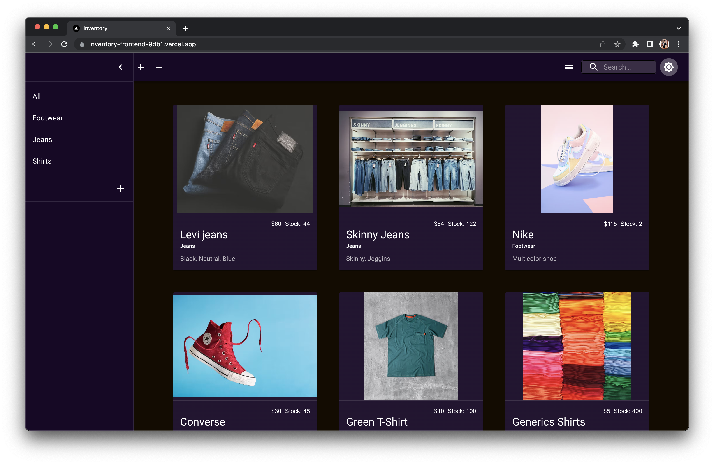

# Inventory Manager Frontend

This is the frontend for the Inventory Manager application. It is a React application that uses NextJS with Typescript.
The backend is a NodeJS application that uses Express and MongoDB.

The aplication can perform the following actions:

- **C**reate a new item
- **R**ead all items from the database
- **U**pdate an existing item
- **D**elete an existing item
- List all items
- List items by category
- Search for an item by name
- Create a new category
- Delete an empty category

## Getting Started

To get started, you will need to have NodeJS installed on your machine. You can download it from [here](https://nodejs.org/en/download/).

Once you have NodeJS installed, you can clone this repository and install the dependencies by running the following commands:

```bash
git clone
cd inventory-manager-frontend
npm install
```

## Running the Application

To run the application, you can run the following command:

```bash
npm run dev
```

This will start the application on port 3000. You can access the application by going to [http://localhost:3000](http://localhost:3000).
